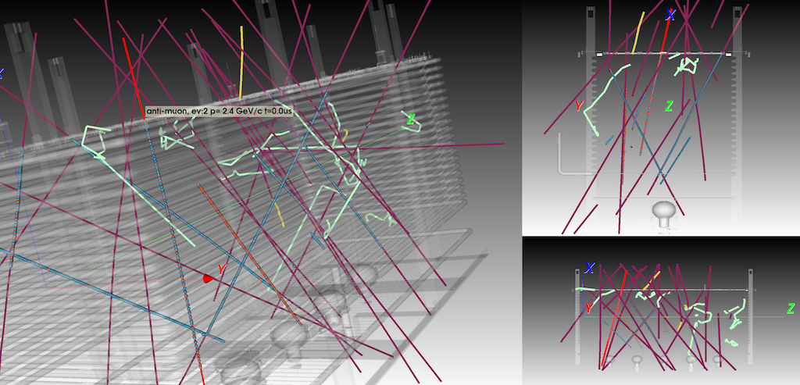
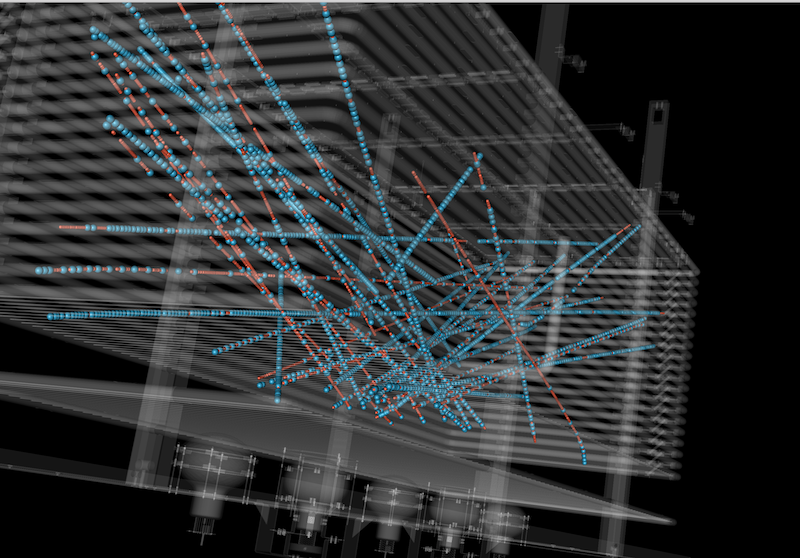

# EventDisplays
This repository contains some event displays for the Dual-Phase LArTPC prototypes.
## VTK Event display

Reads an event from the 3x1x1 LAr TPC (in hdf5 format) and shows the 3D reconstructed hits. Commes in two seperate versions and folders for MC:

Installation and execution in the [README](VTK/MCEventViewer/README.md)

for data:

Installation and execution in the [README](VTK/DataEventViewer/README.md)

## Gallery Event display 
A simple example of an event display plotting raw event data (after pedestal subtraction). The evd is a ROOT macro including the [gallery](http://art.fnal.gov/gallery/) libraries. 

