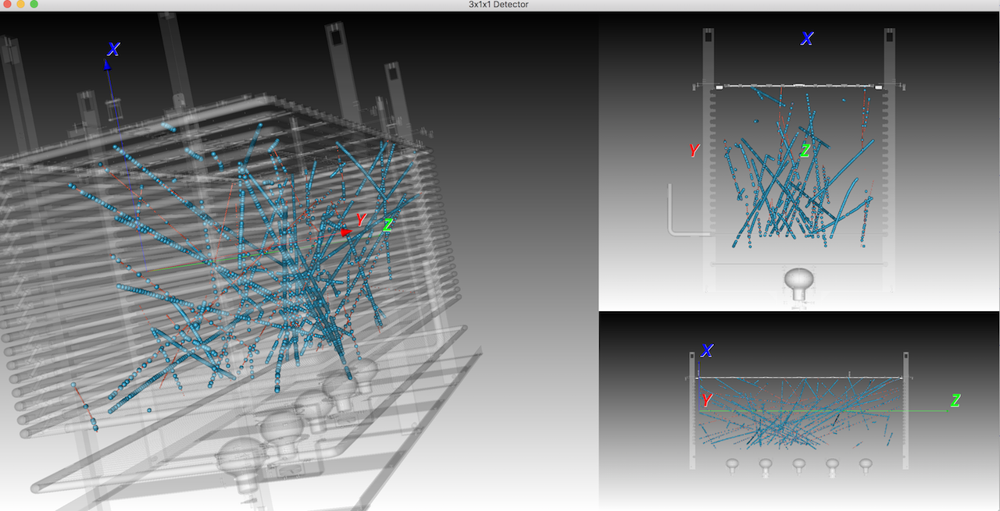

Reads a data event from the 3x1x1 LAr TPC (in hdf5 format) and shows the 3D reconstructed hits

Usage
requires [vtk](https://www.vtk.org) and pandas

example with pip package manager:

$ pip intall vtk

$ pip install tables

$ pip install h5py

You need to download the 3x1x1.obj geometry which is 130MB and copy it to your local directory. Get it from [Dropbox](https://www.dropbox.com/s/lvsrrz614z7fotb/3x1x1-full.vtk?dl=0) or [EOS]()

All 3x1x1 reconstructed data in HDF5 format from the Feb_2018 production are here in [EOS](). Simply pick one.

Now you should be ready to execute (example with Run840_subrun0.hdf5) :

$ python 311Viewer.py -file path/to/run_folder/Run840_subrun0.hdf5 -ev_range 0 50 -trk_length 80

displays all tracks from first 50 events of run 840 that have a length greater than 80

hits from view 0 are diplayed as large blue spheres
hits from view 1 are diplayed as smaller red spheres

In progress the viewer will be able to read and display MC events too. You can hover the mouse over the track and it displays some basic information (event number, track ID, number of hits)

