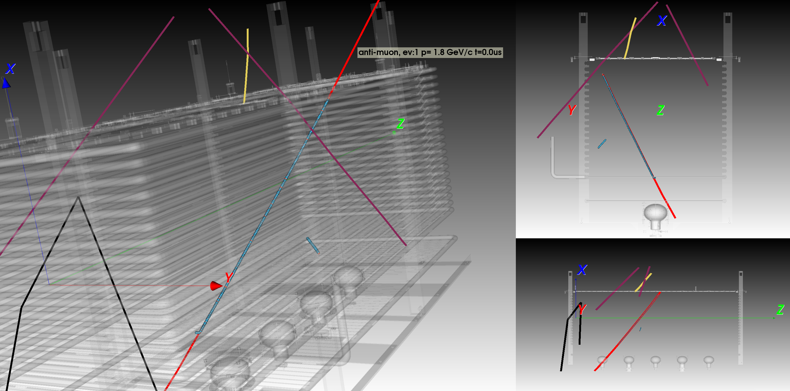

Shows MonteCarlo events from the 3x1x1 LAr TPC (needs run files in HDF5 format not ROOT!) and shows the 3D reconstructed hits

Usage of the viewer
requires [vtk](https://www.vtk.org) and pandas

example with pip package manager:

$ pip intall vtk

$ pip install tables

$ pip install h5py

You need to download the 3x1x1.obj geometry which is 130MB and copy it to your local directory. Get it from [Dropbox](https://www.dropbox.com/s/lvsrrz614z7fotb/3x1x1-full.vtk?dl=0) or [EOS]()

Input Files (MC):

The MC reconstructed data and truth_MC data are stored in seperate files on EOS.
See the WA015 [Tiwki](https://twiki.cern.ch/twiki/bin/view/Sandbox/RecoData3x1x1)

latest MC files are stored there:

$ls /eos/experiment/wa105/offline/LArSoft/MC/MC5/HDF5/

g4detsim  recofast  recofull

take one file from the g4detsim repo and the corresponding file from the recofast repo
You know the correspondance of the files by there prefic number 
Example with files number 0:
0-RecoFast-Parser.hdf5 (is the reconstruced MC)
0-G4Detsim-Parser.hdf5 (is the corresponding truth MC file)

Now you should be ready to execute:

$ python 311MCViewer.py -file MC5-Reco.hdf5 -MCfile 0-G4Detsim-Parser.hdf5 -ev_range 0 10

displays all tracks from first 10 events. Both true MC tracks and reconstructed hits are displayed.
If you don't want to diplay the truth MC simply remove the MC truth file:

$ python 311MCViewer.py -file MC5-Reco.hdf5 -ev_range 0 10

hits from view 0 are diplayed as large blue spheres
hits from view 1 are diplayed as smaller red spheres
Monte Carlo tracks are represented as lines (purple is muons, black is neutrons, mint are gammas, yellow for electrons, lavender for pions)
You can hover the mouse over the reconstructed hits or MC_tracks to display some basic information (event number, track ID, number of hits, MC momentum, ..)

